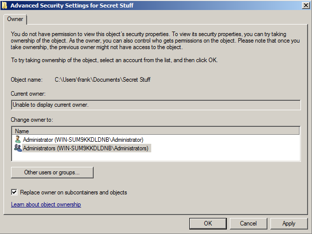
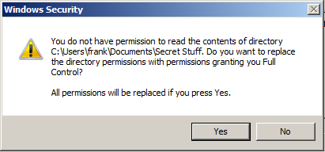
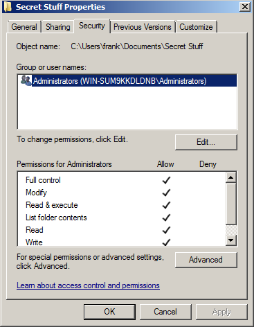
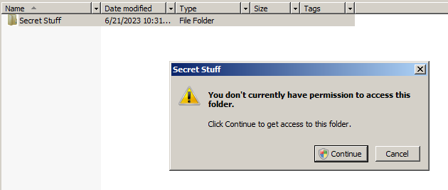

# Repair-NTFSPermissions

Scans NTFS permissions and ensures that BUILTIN\Administrators and NT AUTHORITY\SYSTEM have full control of every file and folder.

## Motivation

Performing administrative activities such as file server migrations, content assessments/scanning, or even basic create/remove/update/delete (CRUD) operations can be impeded if an administrator does not have the required permissions.
At the same time, the author believes that there is little point in disallowing administrators to access file server data -- administrators have the "take ownership" right, which means that an administrator can ultimately gain access to data regardless of what the permissions are.

Therefore, the author believes that administrators not having permission to access folders/files is a configuration error that should be corrected to avoid unnecessary impediments to their work.

However, it is a common "rookie mistake" for administrators to use the graphical interface in Windows to take ownership and gain access to files and folders.
If one were to attempt this, Windows will "steamroll" the existing permissions, replacing them with new permissions that only grant BUILTIN\Administrators the rights to access the content.
THIS IS BAD!

### Danger Zone

If you see images like these, you are in the *danger zone*:

If you've gotten this far, you've already realized that you do not have permission to the content even though you are an administrator:

You might be tempted to click OK - but you shouldn't!

If you do, Windows may give a helpful warning like the following:

Note that the message indicates it will **replace** the directory permissions with permissions granting you Full Control.
**We don't want this!**

If you were to click OK, this is what would happen to the permissions:

While it's nice that you now have access to this content, **you've just removed all user access**.
Chances are that you do not have the previous permissions documented, so you won't have a good way to restore them, either.
This is BAD!

Additionally, clicking on a folder that you do not have access to - or one that you have access to via your administrative privileges when User Account Control (UAC) is enabled - will result in a screen like this:

You should **not** click Continue, because doing so will modify the existing permissions and grant your account, specifically, permissions to the content. This is not desirable in most cases and can take a while for permission assignment to complete.

## Solution

Instead of granting yourself access via the graphical interface, it is possible to run a series of commands (takeown.exe and icacls.exe) granting Administrators and SYSTEM permission to just the folder in question (that object only, no child objects).
This approach does not "steamroll" permissions!

However, you would need to repeat this process over and over again as you gain access to each folder, granting Administrators and SYSTEM permission to the newly discovered files and folders.

This would be very cumbersome and time-consuming!

## Better Solution

I created Repair-NTFSPermissions.ps1 to automate the process of ensuring Administrators and the SYSTEM account have full control of the specified folder and all child objects (subfolders and files).

The script does this by scanning the existing permissions. If permissions cannot be read, it takes ownership of just the current object on behalf of Administrators, then it tries to read the object's permissions again.
If Administrators and SYSTEM already have permission, then no action is taken and the script continues scanning subfolders and files.

If the script finds that Administrators or SYSTEM are missing Full Control permission, then it grants them to just the current object using icacls.

Next, the script scans the permissions again and confirms that Administrators and SYSTEM have full control as expected.
If not, the script takes ownership of just the current object and tries again.

And if it still fails, it takes ownership via an alternative method and tries again.

Additionally, my script handles long paths by first attempting a drive substitution (via subst.exe).
If that fails for any reason, it uses a symbolic link instead. When processing of a long path is completed, the script cleans up the drive substitution or symbolic link.

## Requirements

The script requires PowerShell 2.0 or above - but it can be made to work on PowerShell 1.0 with some modifications (removal of comment-based help, parameters, and instead hard-coding the parameters to a variable assignment).

The script must be run with administrative rights. Open PowerShell as an administrator, then run the script.

You also may need to disable the script execution policy on your system.
One way to do this is:

`Set-ExecutionPolicy Bypass -Scope Process`

or

`Set-ExecutionPolicy RemoteSigned`

## Usage

To run the script, type:

`Repair-NTFSPermissions -PathToFix 'E:\Shares\Human Resources'`

Replace the path `E:\Shares\Human Resources` with the path that you want to ensure Administrators and SYSTEM have permission to.

## Additional Considerations

The script has additional parameters that must be specified if you are running the script from a non-English version of Windows.
This is because the Administrators group and the SYSTEM account may be called something different on non-English versions of Windows.

Additionally, there are optional parameters to:

- Specify an additional account to be granted Full Control over the target file/folders
- Specify an additional account to be granted read-only (read and execute) permission over the target file/folders (experimental and untested)
